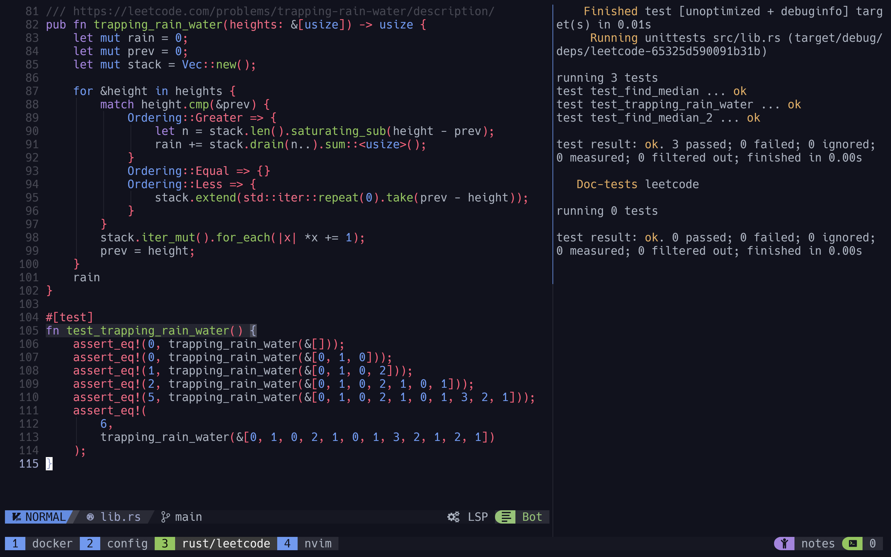

<h3 align="center">
	Tokyo Dark for <a href="https://github.com/tmux/tmux">Tmux</a>
</h3>

<p align="center">
  
</p>

## Themes

- 🌆 [Dark](./tokyo-dark.tmuxtheme)

## Usage

### TPM

1. Install [TPM](https://github.com/tmux-plugins/tpm)
2. Add the tokyo plugin:

```bash
set -g @plugin 'joseburgosguntin/tokyo-dark-tmux'
# ...alongside
set -g @plugin 'tmux-plugins/tpm'
```

3. (Optional) Set your preferred flavour, it defaults to `"dark"`:

```bash
set -g @tokyo_flavour 'night' # or dark (btw night is not made yet)
```

### Manual

1. Copy your desired theme's configuration contents into your Tmux config (usually stored at `~/.tmux.conf`)
2. Reload Tmux by either restarting the session or reloading it with `tmux source-file ~/.tmux.conf`

#### Configuration options

All flavours support certain levels of customization that match our [Catppuccin
Style Guide][style-guide]. To add these customizations, add any of the following
options to your Tmux configuration.

In order to have the correct icons displayed please use your favorite nerd fonts patched font.

##### Enable window tabs

By default, the theme places the `window-status` in the `status-right`. With
`@tokyo_window_tabs_enabled` set to `on`, the theme will place the
directory within the `status-right` and move the window names to the
`window-status` format variables.

```sh
set -g @tokyo_window_tabs_enabled on # or off to disable window_tabs
```

##### Configure separator

By default, the theme will use a round separator for left and right.
To overwrite it use `@tokyo_left_separator` and `@tokyo_right_separator`

```sh
set -g @tokyo_left_separator "█"
set -g @tokyo_right_separator "█"
```

##### Enable DateTime

By default, the `date_time` componenet is set to off.
It can be enabled by specifing any tmux date and time format.

```sh
set -g @tokyo_date_time "%Y-%m-%d %H:%M"
```

##### Enable User

By default, the `user` componenet is set to off.
It can be enabled by toggoling it on.

```sh
set -g @tokyo_user "on"
```

##### Enable Host

By default, the `host` componenet is set to off.
It can be enabled by toggoling it on.

```sh
set -g @tokyo_host "on"
```

[style-guide]: https://github.com/catppuccin/catppuccin/blob/main/docs/style-guide.md

## 💝 Thanks to

- [Pocco81](https://github.com/catppuccin)
- [vinnyA3](https://github.com/vinnyA3)
- [rogeruiz](https://github.com/rogeruiz)
